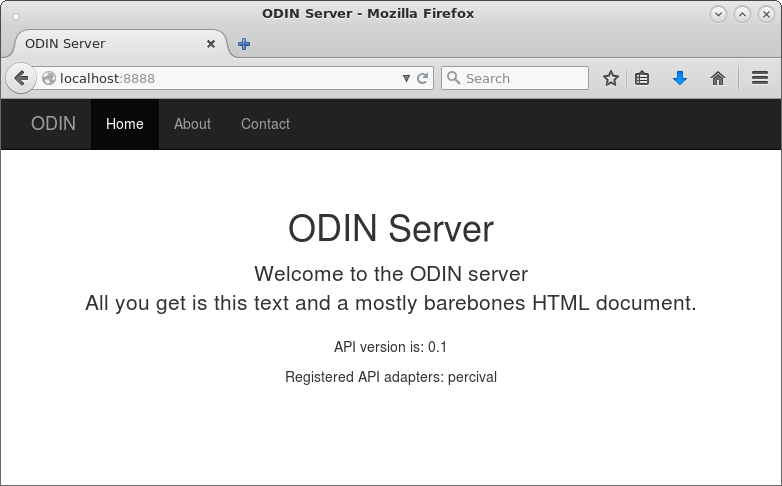
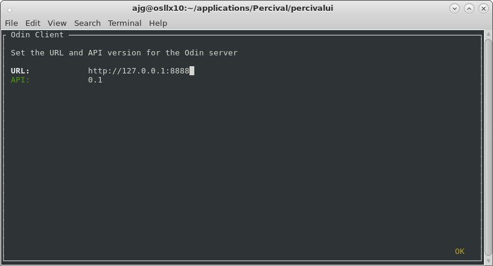
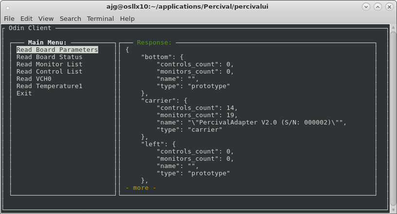
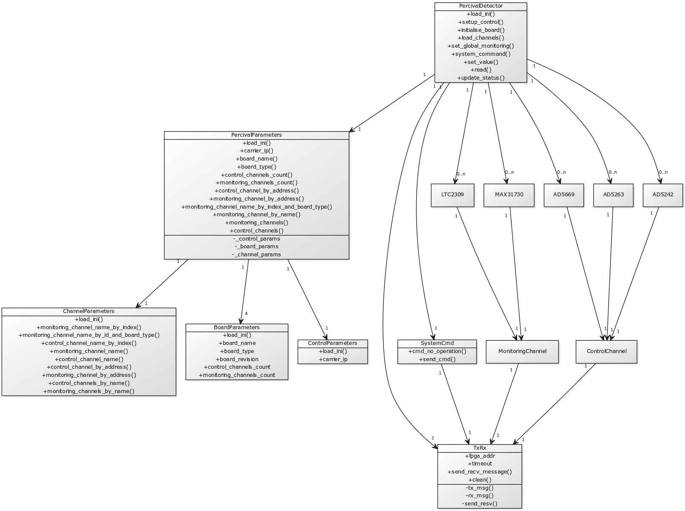

Percival Carrier Board Control Design
=====================================

This document contains design notes to describe the implementation of the Percival carrier board control classes.

The main two detector classes (PercivalDetector and PercivalParameters) are located in the percival/detector/detector.py file.  Currently the detector instance can be started in either a standalone mode or as a plugin within an Odin server.  There are several files provided to help with either method, and they are described in more detail below.

## Overview

The following paragraph presents an overview of the current state of the detector classes.  Further documentation can be generated from the file comments.

PercivalDetector creates PercivalParameters object.
PercivalDetector creates dictionaries for board settings, board values, control objects and monitor objects.
It then establishes communications with the hardware.
If specified it will then download the setup configuration to the hardware.
Parameters are then read back and control and monitoring channels are set up.
Specific device class objects are created for the monitors and controls and are stored in dictionaries, accessed by name.
System commands can be executed.
Control channel values can be set.
Monitor status can be updated (using readback shortcut).
The current list of monitor channels can be read.
The current list of control channels can be read.

### Why Standalone and Odin Server Plugin?

The starting point of this work was a script that could be executed to perform a scan of devices and output monitored data into HDF5 files.  As the work continued further scripts were written to perform other tasks (eg initialise the board, send system commands).
The initial application was created by forming classes from these scripts that could perform the required tasks (based on Ulrik's original set of classes) and at this stage there was no connection between this application and the Odin server.  To make testing of the application easy I *borrowed* the IPC classes and created the interface code for the standalone application.  Using ZeroMQ made the interfacing easy and so I created the client application to interact with the standalone application.  By keeping the client application completely separate from the standalone application it was later straightforward to replace the standalone parts of the application with the equivalent adapter interface so that the detector could be *dropped* into an Odin plugin.

## Simulation

A *very* simple simulator has been developed that provides the correct interface for the detector to connect to and communicate with.
The simulator maintains a set of registers that can be written to.  It understands the concept of readback shortcuts and so can reply with the correct data items when requested.  It also sends EOM responses when expected.
A standalone script has been provided for executing the simulator.

```
python sandbox/simplesimulator.py
```

## Executing as an Adapter for Odin Server Instance

It is possible to load and execute the detector as a plugin of an Odin server instance.  First, some additional setup is required:
- Open the requirements.txt file for the percivalui project and uncomment the line 
```#-e git+git://github.com/percival-detector/odin.git#egg=odin&subdirectory=server```
- Install the Odin server with the pip command
```pip install -r requirements.txt```

Once the Odin application has been installed into the current development environment then it can be started with a configuration file that loads the Percival detector class.
```odin_server --config percival_test.cfg```

To verify that the Odin instance is executing correctly you can open a browser and navigate to localhost:8888



You can see that the web page lists register API adapters as percival.  Requests can now be made to the Percival plugin through the Odin server instance.

An odin client application has been developed to test the Percival plugin.  The client application is another sandbox script.

```
python sandbox/odin_client.py --help
usage: odin_client.py [-h] [-u URL] [-a API]

optional arguments:
  -h, --help         show this help message and exit
  -u URL, --url URL  Address of Odin server
  -a API, --api API  API version
```

Executing this script presents you with the client setup screen.  From this screen you can change the URL or API before connecting to the Odin server instance.



Once the URL and API have been confirmed you are presented with the main screen.  From it is possible to send get requests by selecting the appropriate item from the menu on the left.  Any response from the Odin server is displayed in the right hand response box.



Currently it is not possible to send any put or delete requests from this client.  The client can be exited by selecting the "Exit" option.  Note that exiting the client does not affect the Odin server instance.

## Executing in Standalone Mode

When executing the detector in standalone mode, the classes IpcMessage, IpcChannel and IpcReactor have been utilised to make interaction with the application simple and consistent.  The detector class is created within a PercivalStandalone class, along with a control and status IpcChannel.
IpcMessage objects can be sent to the detector class through the control IpcChannel, and these are decoded by the standalone class before executing the appropriate detector methods.  A sandbox script has been developed to provide a quick method of executing the standalone application:

```
python ./sandbox/percivalcontrol.py --help
usage: percivalcontrol.py [-h] [-w WRITE] [-c CONTROL] [-s STATUS]

optional arguments:
  -h, --help            show this help message and exit
  -w WRITE, --write WRITE
                        Write the initialisation configuration to the board
  -c CONTROL, --control CONTROL
                        ZeroMQ control endpoint
  -s STATUS, --status STATUS
                        ZeroMQ status endpoint
```

Upon executing the percivalcontrol.py file, an instance of PercivalStandalone is created which creates a PercivalDetector, two IpcChannels (one for control and one for status) and an IpcReactor.  If the -w command line parameter is specified then the standalone application calls the initialise_board method of the PercivalDetector which attempts to write the configuration data to the hardware.
The control and monitoring channels are then loaded into the detector and the reactor loop is started.  The standalone application will now wait for control requests through the control channel, and if asked to execute the status loop then the status responses will be published on the status channel.

A standalone client application has been developed to provide interaction with the detector when executing in standalone mode.  This client application is another sandbox script.

```
python ./sandbox/client_example.py --help
usage: client_example.py [-h] [-c CONTROL] [-s STATUS]

optional arguments:
  -h, --help            show this help message and exit
  -c CONTROL, --control CONTROL
                        Control endpoint
  -s STATUS, --status STATUS
                        Status endpoint
```

Executing this script presents the client setup screen.  From this screen you can change the control and status endpoints before starting the client and connecting to the standalone application.


Once the control and status endpoints have been confirmed you are presented with the main screen.  From here it is possible to send IpcMessage objects and receive responses from the standalone application.  It is also possible to start and stop the status loop; starting it will result in the response box periodically updating with new status.


It is also possible to request execution of system commands from the client application.


## Design

The following sections provide some details on the current design of the detector application.



### PercivalParameters

```percival/detector/detector.py```

The PercivalParameters class manages the initialisation files for the Percival control application.  There are currently four BoardParameters instances, one ControlParameters instance and one ChannelParameters instance maintained by this class.  A set of methods are present to provide access to the parameters that are managed by these classes.
The load_ini method will load the specified files into the corresponding instances (currently all ini files are hardcoded, but perhaps the main percival.ini file should in fact contain the others?).
A series of access methods and properties provide easy access to the parameters.  The PercivalDetector class creates and manages a single instance of the PercivalParameters class.

### PercivalDetector

```percival/detector/detector.py```

This is the main detector class, with responsibility for creating the TCP connection to the hardware control port.  This class owns a PercivalParameters instance and will download the configuration to the hardware by default on creation.  Once the configuration has been downloaded (this can be skipped if required) then the hardware is re-read and coupled with the ini file information a set of control devices and monitoring devices are created.  These devices contain the methods and channel data specific to the type of device but present a consistent interface to provide access from external sources.  The monitor device status can be updated by reading the relevant shortcut from the hardware and populating the fields accordingly; a method has been made available to perform this task.
The detector class can send any system command; it manages a SystemCmd object to perform this action.  There is also a method to turn on or off global monitoring (including device level safety controls).  It should be easy to implement further system commands within methods as required to fulfill any required interface (for example start/stop acquisition etc).

### Threading

The TxRx class has been updated to include locking, but currently the PercivalDetector implementation does not perform any threaded execution itself.  There should be no barriers to implementing a multi-threaded approach for the PercivalDetector class; at the early stage it was not necessary for the level of control and status required.

### Connection

There is a current limitation of the connection.  I haven't put much time into development of this, and so loss of connection is not handled (or reconnection). 

### Odin Adapter

There is an Odin adapter class which is heavily based on the Excalibur and Dummy adapters present in the Odin server software.  This is a very early proof of concept, providing the
GET, PUT and DELETE methods.  So far only some GET methods have been implemented (see sections above). 


