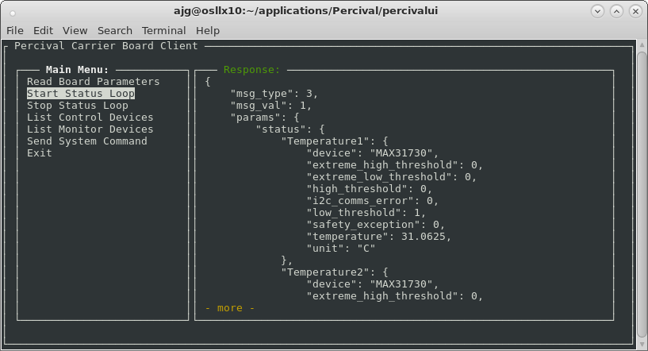
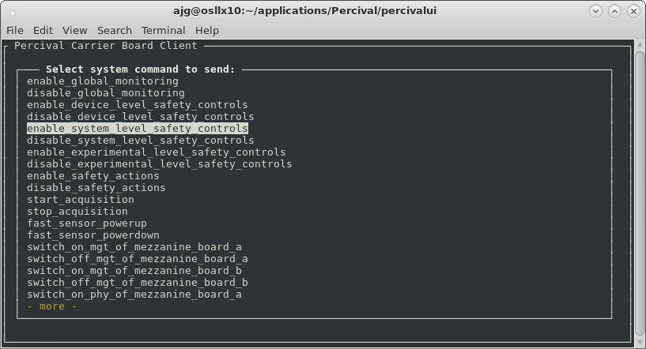

percival-control
----------------

This is a wrapper of all the Percival Control classes into one service application. Open a new Terminal window (or tab)
and start the application with the following commands:

```
# If you are not already in the percivalui dir:
cd Percival/percivalui

source venv27/bin/activate

# Set an environment variable with the IP address of your Carrier Board Xport
export PERCIVAL_CARRIER_IP=xxx.xxx.xxx.xxx

percival-control --init
....
.... lots of applications logs coming out here...

```

To interact with the application/carrier board use the ```percival-client``` application (see below).

To quit the application use the ```CTRL-c```.

percival-client
---------------

This is a terminal text based user interface which allow for sending a number of commands to the carrier board through
the percival-control service.

Start the application in a new Terminal window (or tab) with the following commands:

```
# If you are not already in the percivalui dir:
cd Percival/percivalui

source venv27/bin/activate

percival-client
```

From this screen you can change the control and status endpoints before starting the client and connecting to the
standalone application. Hit enter-enter-enter to accept the default (local) channel settings.


Once the control and status endpoints have been confirmed you are presented with the main screen.  From the left-hand
pane it is possible to send commands/queries to the percival-control application (and thereby the Percival carrier board).
It is also possible to start and stop the status loop; starting it will result in the response box periodically updating
with new status.



It is also possible to request execution of system commands from the client application.



To quit the application use "Exit" option in the left-hand Main Menu panel.
